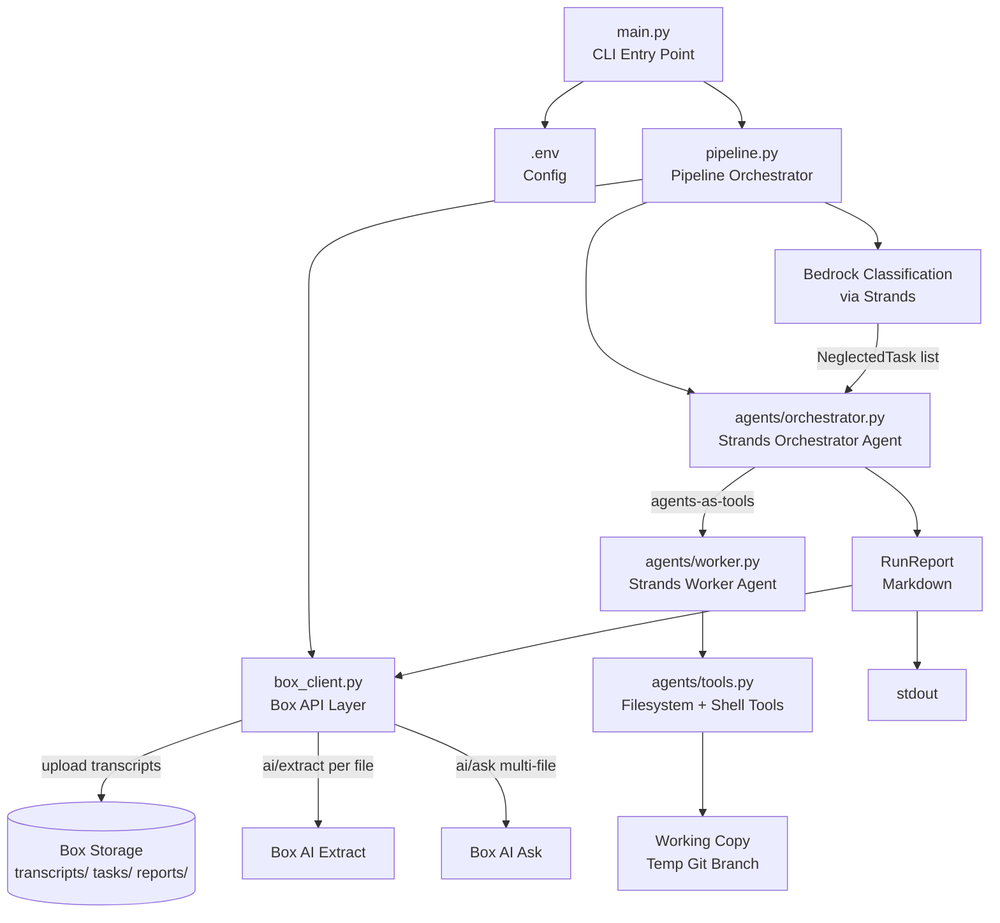

# Design Document: GhostWriter

## Overview

GhostWriter is a local Python CLI tool that processes standup/scrum transcripts through a multi-stage AI pipeline to surface neglected recurring tasks and auto-implement the safe ones as code changes. The pipeline runs entirely from a single CLI command, uses Box as the document AI and storage layer, AWS Bedrock (via Strands Agents SDK) for classification and code generation, and produces a Markdown run report.

The architecture is intentionally layered so a future web UI can call the same `pipeline.py` functions without touching the CLI or agent internals.

---

## Architecture



### Pipeline Stages

| Stage | Component | External Service |
|---|---|---|
| 1. Ingest | `pipeline.py` + `box_client.py` | Box API |
| 2. Extract | `box_client.py` | Box AI Extract |
| 3. Recurrence | `box_client.py` | Box AI Ask (multi-file) |
| 4. Classify | `pipeline.py` + Strands | Amazon Bedrock |
| 5. Orchestrate | `agents/orchestrator.py` | Amazon Bedrock |
| 6. Work | `agents/worker.py` + `agents/tools.py` | Local filesystem |
| 7. Report | `pipeline.py` + `box_client.py` | Box API + stdout |

Stages 1–4 run in `--dry-run` mode. Stages 5–6 are skipped in dry-run.

---

## Components and Interfaces

### `main.py` — CLI Entry Point

Uses `typer` for argument parsing (clean, UI-friendly, easy to wrap later).

```python
def run(
    transcripts: Optional[Path] = typer.Option(None),
    repo: Optional[Path] = typer.Option(None),
    paste: bool = typer.Option(False),
    dry_run: bool = typer.Option(False),
) -> None
```

Responsibilities:
- Load `.env` via `python-dotenv`
- Validate required env vars (`BOX_DEV_TOKEN`, `AWS_REGION`, `BEDROCK_MODEL_ID`)
- Validate CLI argument combinations
- Call `pipeline.run_pipeline(config)` and print the RunReport

### `box_client.py` — Box API Layer

All Box interactions are isolated here. Uses the `boxsdk` Python package with a developer token for V1.

```python
class BoxClient:
    def __init__(self, dev_token: str) -> None

    def upload_transcript(self, file_path: Path, folder_id: str) -> str
        # Returns Box file ID

    def ai_extract(self, file_id: str) -> list[dict]
        # POST /2.0/ai/extract freeform
        # Returns list of raw task dicts

    def ai_ask_multi(self, file_ids: list[str], prompt: str) -> str
        # POST /2.0/ai/ask with mode=multiple_item_qa
        # Returns raw answer string

    def upload_report(self, content: str, folder_id: str) -> str
        # Uploads Markdown report, returns file ID

    def ensure_folder(self, name: str, parent_id: str = "0") -> str
        # Creates folder if not exists, returns folder ID
```

Box AI Extract request body:
```json
{
  "items": [{"type": "file", "id": "<file_id>"}],
  "prompt": "Extract all tasks from this standup transcript...",
  "fields": [
    {"key": "title"},
    {"key": "description"},
    {"key": "owner"},
    {"key": "status_mentioned", "options": ["todo","in_progress","blocked","done","unclear"]},
    {"key": "is_action_item", "type": "boolean"}
  ]
}
```

Box AI Ask multi-file request body:
```json
{
  "mode": "multiple_item_qa",
  "prompt": "Identify tasks mentioned across multiple meetings that were never marked done...",
  "items": [{"type": "file", "id": "<id>"}, ...]
}
```

### `pipeline.py` — Pipeline Orchestrator

Coordinates all stages. Returns a `RunReport`. Designed so each stage is a pure function for testability and future UI integration.

```python
def run_pipeline(config: PipelineConfig) -> RunReport

def ingest(config: PipelineConfig, box: BoxClient) -> list[IngestedFile]
def extract(ingested: list[IngestedFile], box: BoxClient) -> list[Task]
def detect_recurrence(file_ids: list[str], box: BoxClient) -> list[NeglectedTask]
def classify(neglected: list[NeglectedTask], model_id: str) -> list[NeglectedTask]
def orchestrate(neglected: list[NeglectedTask], repo: Path, model_id: str) -> list[WorkerResult]
def build_report(neglected: list[NeglectedTask], results: list[WorkerResult], dry_run: bool) -> RunReport
```

### `agents/orchestrator.py` — Strands Orchestrator Agent

Implements the "agents-as-tools" pattern from the Strands SDK. The orchestrator agent wraps the worker agent as a `@tool` function.

```python
from strands import Agent, tool
from strands.models import BedrockModel

@tool
def run_worker_agent(task_id: str, task_description: str, working_copy_path: str) -> str:
    """Invoke a worker agent to implement a single auto-doable task."""
    worker = build_worker_agent(working_copy_path)
    result = worker(f"[{task_id}] {task_description}")
    return result.message

def build_orchestrator(working_copy: Path, model_id: str) -> Agent:
    model = BedrockModel(model_id=model_id, region_name=os.environ["AWS_REGION"])
    return Agent(
        model=model,
        system_prompt=ORCHESTRATOR_SYSTEM_PROMPT,
        tools=[run_worker_agent, read_file, list_dir, grep],
    )
```

The orchestrator receives the full list of `auto_doable=true` tasks and the working copy path. It calls `run_worker_agent` once per task, collects `WorkerResult` objects, and returns them.

### `agents/worker.py` — Strands Worker Agent

Each worker agent handles exactly one task. It is instantiated fresh per task invocation.

```python
def build_worker_agent(working_copy: Path, model_id: str) -> Agent:
    model = BedrockModel(model_id=model_id, region_name=os.environ["AWS_REGION"])
    return Agent(
        model=model,
        system_prompt=WORKER_SYSTEM_PROMPT.format(working_copy=str(working_copy)),
        tools=[
            make_read_file_tool(working_copy),
            make_write_file_tool(working_copy),
            make_grep_tool(working_copy),
            make_run_shell_tool(working_copy),
        ],
    )
```

After the agent completes, the caller runs `git diff` on the working copy to capture the unified diff and constructs a `WorkerResult`.

### `agents/tools.py` — Tool Definitions

All tools are factory functions that close over `working_copy: Path` to enforce path restrictions.

```python
SHELL_ALLOWLIST = [
    "pytest", "python -m pytest", "python -m unittest",
    "flake8", "ruff", "ruff check", "eslint",
    "make test", "make lint", "npm test", "npm run test",
    "cargo test", "go test",
]

def make_read_file_tool(working_copy: Path) -> Callable
def make_write_file_tool(working_copy: Path) -> Callable  # enforces path is inside working_copy
def make_grep_tool(working_copy: Path) -> Callable
def make_run_shell_tool(working_copy: Path) -> Callable   # enforces SHELL_ALLOWLIST
```

Path safety check (used in write and shell tools):
```python
def _assert_inside_working_copy(path: Path, working_copy: Path) -> None:
    resolved = path.resolve()
    if not str(resolved).startswith(str(working_copy.resolve())):
        raise SecurityError(f"Path {resolved} is outside working copy {working_copy}")
```

### `models.py` — Data Models

All models use `pydantic.BaseModel` for validation and easy JSON serialization (UI-ready).

```python
from pydantic import BaseModel
from enum import Enum
from typing import Optional

class StatusMentioned(str, Enum):
    TODO = "todo"
    IN_PROGRESS = "in_progress"
    BLOCKED = "blocked"
    DONE = "done"
    UNCLEAR = "unclear"

class Task(BaseModel):
    title: str
    description: str
    owner: Optional[str] = None
    status_mentioned: StatusMentioned = StatusMentioned.UNCLEAR
    is_action_item: bool = False
    source_transcript: str  # filename

class NeglectedTask(BaseModel):
    id: str  # slug derived from title
    title: str
    description: str
    reason: str  # e.g. "raised in 3 standups, still unassigned"
    auto_doable: bool = False
    auto_doable_category: Optional[str] = None  # e.g. "fix typo"
    classification_reasoning: Optional[str] = None

class WorkerResult(BaseModel):
    task_id: str
    success: bool
    diff: Optional[str] = None
    summary: str
    test_status: Optional[str] = None  # "passed" | "failed" | "skipped"
    error: Optional[str] = None

class IngestedFile(BaseModel):
    filename: str
    box_file_id: str

class PipelineConfig(BaseModel):
    transcripts_dir: Optional[Path] = None
    paste_content: Optional[str] = None
    repo: Optional[Path] = None
    dry_run: bool = False
    box_dev_token: str
    aws_region: str
    bedrock_model_id: str
    box_root_folder_id: str = "0"

class RunReport(BaseModel):
    run_id: str
    dry_run: bool
    neglected_tasks: list[NeglectedTask]
    worker_results: list[WorkerResult]
    report_box_file_id: Optional[str] = None

    def to_markdown(self) -> str: ...
```

---

## Data Models

### Task Extraction Schema

Box AI Extract is called with a freeform prompt and a structured fields list. The response is parsed into `Task` objects. Fields that Box AI cannot determine are left as defaults.

### NeglectedTask Lifecycle

```
Task (extracted per transcript)
  → NeglectedTask (identified by Box AI Ask multi-file)
    → NeglectedTask with auto_doable flag (set by Bedrock classification)
      → WorkerResult (produced by Worker agent, if auto_doable=true)
```

### Working Copy Layout

```
/tmp/ghostwriter-<run_id>/
  repo/                  ← shutil.copytree of --repo
    .git/                ← git branch: ghostwriter/auto-<timestamp>
    <original files>
```

The orchestrator creates the temp dir, copies the repo, initializes the branch, then passes the path to workers. After all tasks complete, it pushes the branch to the GitHub remote (if a remote is configured).

---

## Correctness Properties

*A property is a characteristic or behavior that should hold true across all valid executions of a system — essentially, a formal statement about what the system should do. Properties serve as the bridge between human-readable specifications and machine-verifiable correctness guarantees.*

Property 1: Worker write path confinement
*For any* file path passed to the `write_file` tool, if that path resolves to a location outside the working copy directory, the tool SHALL raise a `SecurityError` and not write any bytes.
**Validates: Requirements 6.5, 6.6**

Property 2: Shell allowlist enforcement
*For any* shell command string passed to `run_shell`, if no prefix in `SHELL_ALLOWLIST` matches the command, the tool SHALL reject the call and return an error without executing the command.
**Validates: Requirements 9.1, 9.2**

Property 3: Classification conservatism
*For any* NeglectedTask whose description contains keywords associated with auth, payments, migrations, infrastructure, or code deletion, the classifier SHALL set `auto_doable=false`.
**Validates: Requirements 5.3, 5.4**

Property 4: Dry-run produces no working copy
*For any* pipeline run with `dry_run=True`, no temporary working copy directory SHALL be created and no git branch SHALL be created.
**Validates: Requirements 1.3, 7.4**

Property 5: Task extraction schema completeness
*For any* Box AI Extract response, the parser SHALL produce a `Task` object with all required fields populated (using defaults for missing optional fields) and SHALL NOT raise an exception on partial responses.
**Validates: Requirements 3.2, 3.4**

Property 6: WorkerResult diff round-trip
*For any* successful Worker execution that modifies at least one file, the `diff` field of the returned `WorkerResult` SHALL be a non-empty string parseable as a unified diff.
**Validates: Requirements 8.4**

Property 7: Report completeness
*For any* RunReport, the Markdown output SHALL contain a section for neglected tasks, a section for auto-attempted tasks (or a note that none were attempted), and a section for report-only tasks.
**Validates: Requirements 10.1, 10.2**

Property 8: Test suite regression guard
*For any* Worker change that causes the existing test suite to fail, the WorkerResult SHALL record `test_status="failed"` and the Orchestrator SHALL revert that task's changes in the working copy.
**Validates: Requirements 8.7, 8.8**

---

## Error Handling

| Failure Point | Behavior |
|---|---|
| Missing env var at startup | Print named var, exit 1 |
| Transcript file unreadable | Log + skip, continue |
| Box upload fails | Log + skip that transcript |
| Box AI Extract fails for one file | Log + skip, continue with others |
| Box AI Ask (recurrence) fails | Log + halt pipeline, exit 1 |
| Bedrock classification fails for one task | Default `auto_doable=false`, log, continue |
| Worker write outside working copy | Raise `SecurityError`, log, mark task failed |
| Worker shell command not allowlisted | Reject, log security violation, mark task failed |
| Worker test suite fails | Record failure, revert changes, continue to next task |
| Box report upload fails | Log error, still print to stdout, exit 1 |
| Git push fails | Log warning, report includes local branch name, exit 0 |

All errors are logged to stdout with the format: `[GhostWriter][<stage>][<task_id>] <message>`.

---

## Testing Strategy

### Dual Testing Approach

Both unit tests and property-based tests are required. They are complementary:
- Unit tests catch concrete bugs in specific scenarios and edge cases.
- Property tests verify universal correctness across all valid inputs.

### Property-Based Testing

Library: **`hypothesis`** (Python, mature, well-maintained).

Each property test runs a minimum of 100 iterations. Tests are tagged with a comment referencing the design property:

```python
# Feature: ghostwriter, Property 2: Shell allowlist enforcement
@given(st.text())
@settings(max_examples=200)
def test_shell_allowlist_rejects_arbitrary_commands(cmd: str):
    assume(not any(cmd.startswith(p) for p in SHELL_ALLOWLIST))
    result = run_shell_safe(cmd, working_copy=Path("/tmp/test"))
    assert result["error"] is not None
```

### Property Test Coverage

| Property | Test File | Hypothesis Strategy |
|---|---|---|
| P1: Write path confinement | `tests/test_tools.py` | `st.text()` for paths |
| P2: Shell allowlist | `tests/test_tools.py` | `st.text()` for commands |
| P3: Classification conservatism | `tests/test_pipeline.py` | `st.builds(NeglectedTask)` with forced keywords |
| P4: Dry-run no working copy | `tests/test_pipeline.py` | `st.builds(PipelineConfig, dry_run=st.just(True))` |
| P5: Task extraction schema | `tests/test_box_client.py` | `st.dictionaries(...)` for partial Box AI responses |
| P6: WorkerResult diff | `tests/test_worker.py` | `st.builds(...)` for task descriptions |
| P7: Report completeness | `tests/test_pipeline.py` | `st.builds(RunReport)` |
| P8: Test suite regression guard | `tests/test_orchestrator.py` | Simulated failing test suites |

### Unit Test Coverage

- `test_cli.py`: Argument validation, missing env vars, `--dry-run` flag behavior
- `test_box_client.py`: Upload, extract, ask, report upload (mocked Box API)
- `test_pipeline.py`: Each stage function with mocked dependencies
- `test_tools.py`: Path safety, allowlist, edge cases (empty path, root path, symlinks)
- `test_models.py`: Pydantic validation, `to_markdown()` output format
- `test_orchestrator.py`: Agent invocation, branch creation, commit behavior (mocked Strands)
- `test_worker.py`: Tool calls, diff generation, test detection (mocked Strands)

### Test Infrastructure

- `pytest` as the test runner
- `pytest-mock` for mocking Box SDK and Strands SDK calls
- `hypothesis` for property-based tests
- `tmp_path` fixture for working copy tests
- Sample data in `sample/` and `sample_repo/` used in integration-style unit tests
